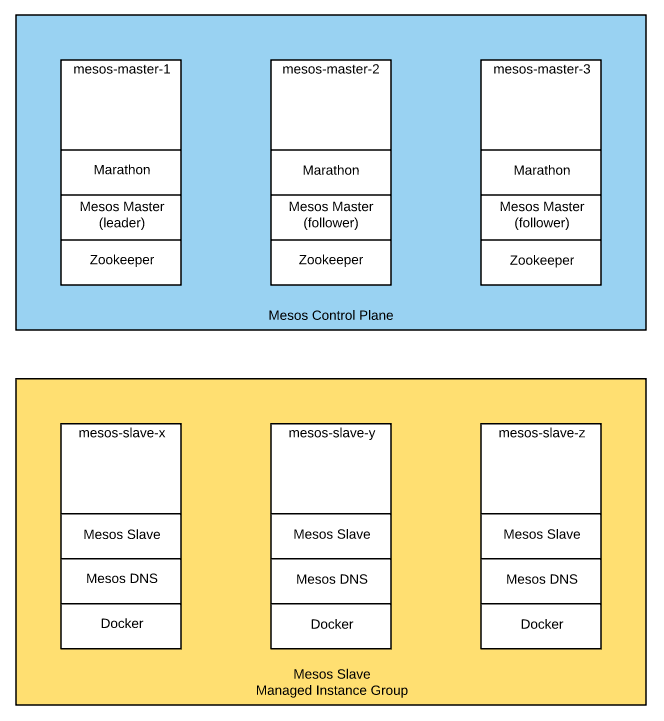

# Deployment Manager Templates for Mesos

This repository contains Deployment Manager template for deploying a scalable
Mesos cluster. By default, this will deploy a Mesos Cluster with the following
topology:

The control plane is deployed as individual instances with 3 nodes and a quorum
of 2 set. Marathon is running on all hosts and will redirect requests to the
currently running leader.

The Mesos slaves are deployed as an instance group that can be scaled horizontally.
Each slave node is running Mesos DNS and the Docker daemon. The slaves have
been configured to be able to use both Docker and Mesos containerizers. In order
to customize the slaves, add to the deployment script, `slave_startup_script.sh`.
The initial number of slaves can be configured in `mesos.yaml`, by default it is
set to 3.

## Deploying

1. Download the repository.
1. Ensure the configuration of the cluster is to your liking in `mesos.yaml`
1. Create the deployment:

       gcloud deployment-manager deployments create --config mesos.yaml mesos
1. Once instance provisioning is complete access the Marathon UI by navigating to port
   8080 of a control plane instance in your browser. The Mesos master UI is available at
   port 5050.

## Teardown

1. Delete the deployment by running:

       gcloud deployment-manager deployments delete mesos
